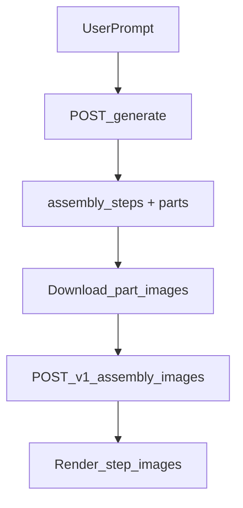

## Assembly Step Images Frontend Integration

This document describes how to integrate the assembly step image pipeline into the frontend.

### Overview

The pipeline has two backend services:
- **Main backend** (`/generate`, port `5000`): returns parts list + `assembly_steps` + `assembled_product_image`.
- **Assembly images service** (`/v1/assembly-images`, port `5001`): returns one image per step.

The frontend flow is:
1) User enters a prompt.
2) Call `/generate` to get `assembly_steps` and parts (with image URLs).
3) Build a request for `/v1/assembly-images`:
   - Use the `assembly_steps` as `steps[*].human_description`.
   - Convert part image URLs into `reference_images` (download and base64-encode).
4) Render returned step images (`image_b64`) in the UI.

### Endpoints

**Main backend**
- `POST http://localhost:5000/generate`
- Request:
```json
{ "description": "A CO2 sensor for my room" }
```
- Response (shape):
```json
{
  "Microcontrollers": { "ESP": [ { "name": "...", "image_url": "..." } ] },
  "Sensors": { ... },
  "Displays": { ... },
  "assembled_product_image": { "imageUrl": "data:image/png;base64,..." },
  "assembly_steps": [
    "Step 1: ...",
    "Step 2: ..."
  ]
}
```

**Assembly images service**
- `POST http://localhost:5001/v1/assembly-images`
- Request:
```json
{
  "project_id": "lcd-breadboard-1602",
  "title": "lcd-breadboard-1602",
  "scene": { "modules": ["LCD 1602", "breadboard", "jumper wires"] },
  "reference_images": [
    {
      "label": "LCD 1602 module",
      "description": "Displays - LCD",
      "image_b64": "...",
      "mime_type": "image/png"
    }
  ],
  "steps": [
    { "id": 1, "human_description": "Step 1: ..." },
    { "id": 2, "human_description": "Step 2: ..." }
  ]
}
```
- Response:
```json
{
  "project_id": "lcd-breadboard-1602",
  "images": [
    { "step": 1, "image_b64": "..." },
    { "step": 2, "image_b64": "..." }
  ]
}
```

### Frontend integration details

#### 1) Call `/generate`
- Triggered by the user prompt submission.
- Use the returned `assembly_steps` and parts list to build the next request.

#### 2) Build `reference_images`
- The `image_url` values in the parts list are remote URLs (AliExpress, DigiKey, etc).
- The assembly-images-service expects base64 data, so the frontend needs to:
  1. Fetch each `image_url`
  2. Convert the binary response to base64
  3. Pass it in `reference_images`
- Example browser-side conversion:
```js
async function urlToBase64(url) {
  const res = await fetch(url);
  const blob = await res.blob();
  const arrayBuffer = await blob.arrayBuffer();
  const bytes = new Uint8Array(arrayBuffer);
  let binary = "";
  bytes.forEach((b) => (binary += String.fromCharCode(b)));
  return btoa(binary);
}
```

> Note: If you run into CORS issues fetching these URLs in the browser, proxy the downloads through the backend.

#### 3) Call `/v1/assembly-images`
- Build the payload from steps + reference images.
- The service requires images as base64; unsupported formats (like AVIF) are converted server-side.
- The prompt explicitly enforces **no text** in the generated images.

#### 4) Render step images
- Each `image_b64` is a PNG base64 string.
- Render in the UI as:
```js
const src = `data:image/png;base64,${image_b64}`;
```

### Suggested frontend data flow



### Error handling

- `/generate` errors:
  - Show a retry button.
  - Report missing API keys or Snowflake credentials if returned.
- `/v1/assembly-images` errors:
  - Show an error state (e.g., "Image generation failed, retry").
  - Retry with fewer reference images if a request fails.

### Config

Frontend should use environment variables:
- `NEXT_PUBLIC_BACKEND_URL` (default `http://localhost:5000`)
- `NEXT_PUBLIC_ASSEMBLY_IMAGES_URL` (default `http://localhost:5001`)

### Notes

- The assembly-images-service converts unsupported image formats (AVIF) to PNG.
- The prompt now enforces **no text/labels** in images.
